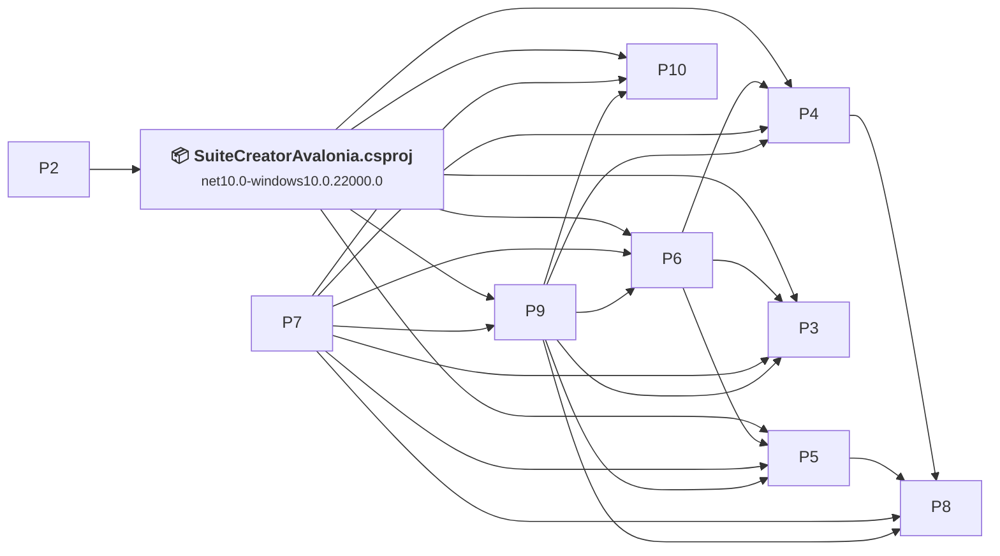
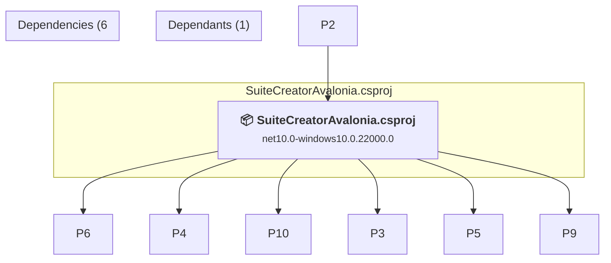

# Projects and dependencies analysis

This document provides a comprehensive overview of the projects and their dependencies in the context of upgrading to .NETCoreApp,Version=v10.0.

## Table of Contents

- [Executive Summary](#executive-Summary)
  - [Highlevel Metrics](#highlevel-metrics)
  - [Projects Compatibility](#projects-compatibility)
  - [Package Compatibility](#package-compatibility)
  - [API Compatibility](#api-compatibility)
- [Aggregate NuGet packages details](#aggregate-nuget-packages-details)
- [Top API Migration Challenges](#top-api-migration-challenges)
  - [Technologies and Features](#technologies-and-features)
  - [Most Frequent API Issues](#most-frequent-api-issues)
- [Projects Relationship Graph](#projects-relationship-graph)
- [Project Details](#project-details)

  - [%USERPROFILE%\GitHubRepos\SuiteCreatorSolution\Logger\Logger.csproj](#%userprofile%githubrepossuitecreatorsolutionloggerloggercsproj)
  - [%USERPROFILE%\GitHubRepos\SuiteCreatorSolution\MSITools\MSITools.csproj](#%userprofile%githubrepossuitecreatorsolutionmsitoolsmsitoolscsproj)
  - [%USERPROFILE%\GitHubRepos\SuiteCreatorSolution\MSIxTools\MSIxTools.csproj](#%userprofile%githubrepossuitecreatorsolutionmsixtoolsmsixtoolscsproj)
  - [%USERPROFILE%\GitHubRepos\SuiteCreatorSolution\SuiteCreatorAvalonia.Desktop\SuiteCreatorAvalonia.Desktop.csproj](#%userprofile%githubrepossuitecreatorsolutionsuitecreatoravaloniadesktopsuitecreatoravaloniadesktopcsproj)
  - [%USERPROFILE%\GitHubRepos\SuiteCreatorSolution\SuiteCreatorModels\SuiteCreatorModels.csproj](#%userprofile%githubrepossuitecreatorsolutionsuitecreatormodelssuitecreatormodelscsproj)
  - [%USERPROFILE%\GitHubRepos\SuiteCreatorSolution\SuiteExecutor\SuiteExecutor.csproj](#%userprofile%githubrepossuitecreatorsolutionsuiteexecutorsuiteexecutorcsproj)
  - [%USERPROFILE%\GitHubRepos\SuiteCreatorSolution\SuiteOperations\SuiteOperations.csproj](#%userprofile%githubrepossuitecreatorsolutionsuiteoperationssuiteoperationscsproj)
  - [%USERPROFILE%\GitHubRepos\SuiteCreatorSolution\SystemTools\SystemTools.csproj](#%userprofile%githubrepossuitecreatorsolutionsystemtoolssystemtoolscsproj)
  - [%USERPROFILE%\GitHubRepos\SuiteCreatorSolution\UserTools\UserTools.csproj](#%userprofile%githubrepossuitecreatorsolutionusertoolsusertoolscsproj)
  - [SuiteCreatorAvalonia.csproj](#suitecreatoravaloniacsproj)

## Executive Summary

### Highlevel Metrics

| Metric | Count | Status |
| :--- | :---: | :--- |
| Total Projects | 10 | 1 require upgrade |
| Total NuGet Packages | 19 | All compatible |
| Total Code Files | 217 |  |
| Total Code Files with Incidents | 1 |  |
| Total Lines of Code | 23576 |  |
| Total Number of Issues | 2 |  |
| Estimated LOC to modify | 0+ | at least 0.0% of codebase |

### Projects Compatibility

| Project | Target Framework | Difficulty | Package Issues | API Issues | Est. LOC Impact | Description |
| :--- | :---: | :---: | :---: | :---: | :---: | :--- |
| [%USERPROFILE%\GitHubRepos\SuiteCreatorSolution\Logger\Logger.csproj](#%userprofile%githubrepossuitecreatorsolutionloggerloggercsproj) | net481 | 🟢 Low | 0 | 0 |  | ClassicClassLibrary, Sdk Style = False |
| [%USERPROFILE%\GitHubRepos\SuiteCreatorSolution\MSITools\MSITools.csproj](#%userprofile%githubrepossuitecreatorsolutionmsitoolsmsitoolscsproj) | net10.0-windows10.0.22000.0 | ✅ None | 0 | 0 |  | ClassLibrary, Sdk Style = True |
| [%USERPROFILE%\GitHubRepos\SuiteCreatorSolution\MSIxTools\MSIxTools.csproj](#%userprofile%githubrepossuitecreatorsolutionmsixtoolsmsixtoolscsproj) | net10.0-windows10.0.22000.0 | ✅ None | 0 | 0 |  | WinUI, Sdk Style = True |
| [%USERPROFILE%\GitHubRepos\SuiteCreatorSolution\SuiteCreatorAvalonia.Desktop\SuiteCreatorAvalonia.Desktop.csproj](#%userprofile%githubrepossuitecreatorsolutionsuitecreatoravaloniadesktopsuitecreatoravaloniadesktopcsproj) | net10.0-windows10.0.22000.0 | ✅ None | 0 | 0 |  | WinForms, Sdk Style = True |
| [%USERPROFILE%\GitHubRepos\SuiteCreatorSolution\SuiteCreatorModels\SuiteCreatorModels.csproj](#%userprofile%githubrepossuitecreatorsolutionsuitecreatormodelssuitecreatormodelscsproj) | net10.0-windows10.0.22000.0 | ✅ None | 0 | 0 |  | WinUI, Sdk Style = True |
| [%USERPROFILE%\GitHubRepos\SuiteCreatorSolution\SuiteExecutor\SuiteExecutor.csproj](#%userprofile%githubrepossuitecreatorsolutionsuiteexecutorsuiteexecutorcsproj) | net10.0-windows10.0.22000.0 | ✅ None | 0 | 0 |  | WinUI, Sdk Style = True |
| [%USERPROFILE%\GitHubRepos\SuiteCreatorSolution\SuiteOperations\SuiteOperations.csproj](#%userprofile%githubrepossuitecreatorsolutionsuiteoperationssuiteoperationscsproj) | net10.0-windows10.0.22000.0 | ✅ None | 0 | 0 |  | WinUI, Sdk Style = True |
| [%USERPROFILE%\GitHubRepos\SuiteCreatorSolution\SystemTools\SystemTools.csproj](#%userprofile%githubrepossuitecreatorsolutionsystemtoolssystemtoolscsproj) | net10.0-windows10.0.22000.0 | ✅ None | 0 | 0 |  | ClassLibrary, Sdk Style = True |
| [%USERPROFILE%\GitHubRepos\SuiteCreatorSolution\UserTools\UserTools.csproj](#%userprofile%githubrepossuitecreatorsolutionusertoolsusertoolscsproj) | net10.0-windows10.0.22000.0 | ✅ None | 0 | 0 |  | ClassLibrary, Sdk Style = True |
| [SuiteCreatorAvalonia.csproj](#suitecreatoravaloniacsproj) | net10.0-windows10.0.22000.0 | ✅ None | 0 | 0 |  | WinUI, Sdk Style = True |

### Package Compatibility

| Status | Count | Percentage |
| :--- | :---: | :---: |
| ✅ Compatible | 19 | 100.0% |
| ⚠️ Incompatible | 0 | 0.0% |
| 🔄 Upgrade Recommended | 0 | 0.0% |
| ***Total NuGet Packages*** | ***19*** | ***100%*** |

### API Compatibility

| Category | Count | Impact |
| :--- | :---: | :--- |
| 🔴 Binary Incompatible | 0 | High - Require code changes |
| 🟡 Source Incompatible | 0 | Medium - Needs re-compilation and potential conflicting API error fixing |
| 🔵 Behavioral change | 0 | Low - Behavioral changes that may require testing at runtime |
| ✅ Compatible | 120 |  |
| ***Total APIs Analyzed*** | ***120*** |  |

## Aggregate NuGet packages details

| Package | Current Version | Suggested Version | Projects | Description |
| :--- | :---: | :---: | :--- | :--- |
| Avalonia | 11.3.10 |  | [SuiteCreatorAvalonia.csproj](#suitecreatoravaloniacsproj) | ✅Compatible |
| Avalonia.AvaloniaEdit | 11.3.0 |  | [SuiteCreatorAvalonia.csproj](#suitecreatoravaloniacsproj) | ✅Compatible |
| Avalonia.Controls.ColorPicker | 11.3.10 |  | [SuiteCreatorAvalonia.csproj](#suitecreatoravaloniacsproj) | ✅Compatible |
| Avalonia.Controls.DataGrid | 11.3.10 |  | [SuiteCreatorAvalonia.csproj](#suitecreatoravaloniacsproj) | ✅Compatible |
| Avalonia.Desktop | 11.3.10 |  | [SuiteCreatorAvalonia.csproj](#suitecreatoravaloniacsproj) | ✅Compatible |
| Avalonia.Diagnostics | 11.3.10 |  | [SuiteCreatorAvalonia.csproj](#suitecreatoravaloniacsproj) | ✅Compatible |
| Avalonia.Fonts.Inter | 11.3.10 |  | [SuiteCreatorAvalonia.csproj](#suitecreatoravaloniacsproj) | ✅Compatible |
| Avalonia.Labs.Gif | 11.3.1 |  | [SuiteCreatorAvalonia.csproj](#suitecreatoravaloniacsproj) | ✅Compatible |
| Avalonia.Themes.Fluent | 11.3.10 |  | [SuiteCreatorAvalonia.csproj](#suitecreatoravaloniacsproj) | ✅Compatible |
| AvaloniaUI.DiagnosticsSupport | 2.1.1 |  | [SuiteCreatorAvalonia.csproj](#suitecreatoravaloniacsproj) | ✅Compatible |
| CommunityToolkit.Mvvm | 8.4.0 |  | [SuiteCreatorAvalonia.csproj](#suitecreatoravaloniacsproj) | ✅Compatible |
| DialogHost.Avalonia | 0.10.3 |  | [SuiteCreatorAvalonia.csproj](#suitecreatoravaloniacsproj) | ✅Compatible |
| Material.Icons.Avalonia | 2.4.1 |  | [SuiteCreatorAvalonia.csproj](#suitecreatoravaloniacsproj) | ✅Compatible |
| Microsoft.Extensions.DependencyInjection | 10.0.1 |  | [SuiteCreatorAvalonia.csproj](#suitecreatoravaloniacsproj) | ✅Compatible |
| Microsoft.PowerShell.5.ReferenceAssemblies | 1.1.0 |  | [SuiteCreatorAvalonia.csproj](#suitecreatoravaloniacsproj) | ✅Compatible |
| Microsoft.PowerShell.SDK | 7.5.4 |  | [SuiteCreatorAvalonia.csproj](#suitecreatoravaloniacsproj) | ✅Compatible |
| Newtonsoft.Json | 13.0.4 |  | [SuiteCreatorAvalonia.csproj](#suitecreatoravaloniacsproj) | ✅Compatible |
| System.Drawing.Common | 10.0.1 |  | [SuiteCreatorAvalonia.csproj](#suitecreatoravaloniacsproj) | ✅Compatible |
| TextMateSharp.Grammars | 2.0.2 |  | [SuiteCreatorAvalonia.csproj](#suitecreatoravaloniacsproj) | ✅Compatible |

## Top API Migration Challenges

### Technologies and Features

| Technology | Issues | Percentage | Migration Path |
| :--- | :---: | :---: | :--- |

### Most Frequent API Issues

| API | Count | Percentage | Category |
| :--- | :---: | :---: | :--- |

## Projects Relationship Graph

Legend:
📦 SDK-style project
⚙️ Classic project

## Project Details

### SuiteCreatorAvalonia.csproj

#### Project Info

- **Current Target Framework:** net10.0-windows10.0.22000.0✅
- **SDK-style**: True
- **Project Kind:** WinUI
- **Dependencies**: 6
- **Dependants**: 1
- **Number of Files**: 174
- **Lines of Code**: 16128
- **Estimated LOC to modify**: 0+ (at least 0.0% of the project)

#### Dependency Graph

Legend:
📦 SDK-style project
⚙️ Classic project

### API Compatibility

| Category | Count | Impact |
| :--- | :---: | :--- |
| 🔴 Binary Incompatible | 0 | High - Require code changes |
| 🟡 Source Incompatible | 0 | Medium - Needs re-compilation and potential conflicting API error fixing |
| 🔵 Behavioral change | 0 | Low - Behavioral changes that may require testing at runtime |
| ✅ Compatible | 0 |  |
| ***Total APIs Analyzed*** | ***0*** |  |

