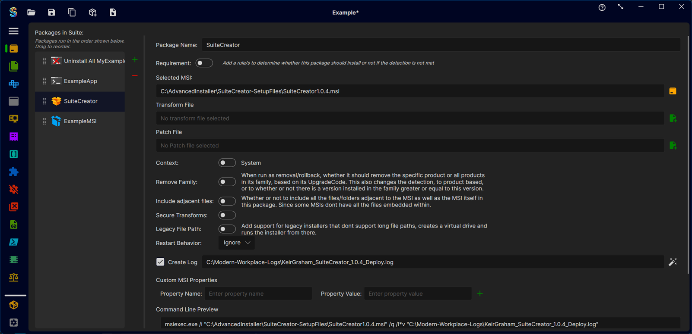
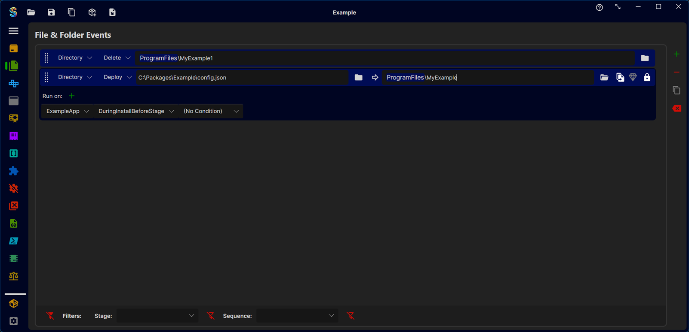
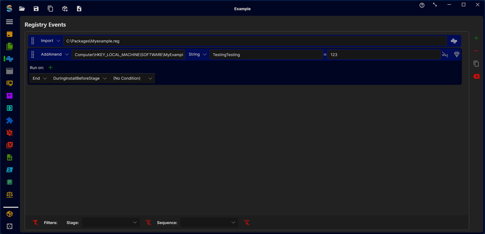
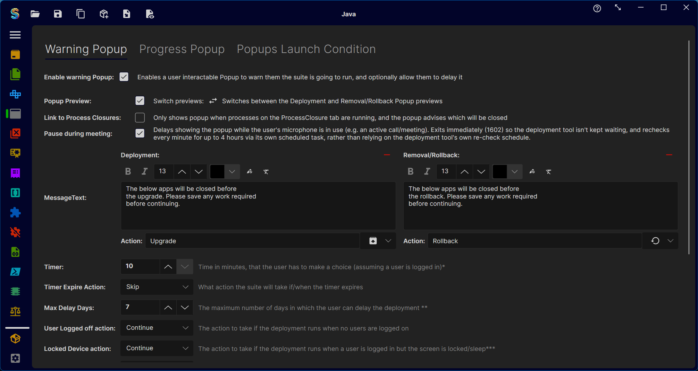
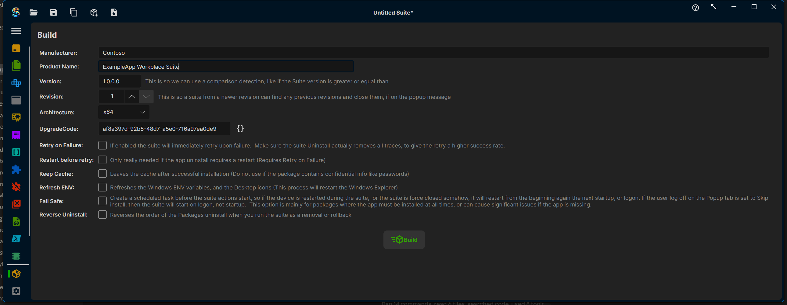

# Suite Creator

Suite Creator lets software packagers bundle multiple installs, uninstalls, and configuration steps into a single deployable **suite** — one executable that your deployment tool (Intune, SCCM, PDQ, etc.) can push out like any other package.

Instead of hand-rolling a wrapper script per app, you build the suite visually: add your packages, the files/registry/environment changes they need, any end-user messaging, then hit Build. Suite Creator produces a single executable plus a detection rule for your deployment tool.

> **Note:** Suite Creator is a new project. It's actively used and maintained, but as with any early-stage app you may run into bugs or rough edges — see [Contributing](#contributing) below for how to report them.

**[⬇ Download the latest release](../../releases/latest)**

## What you can bundle into a suite

- **Packages** — MSI, MSIX, or any other installer executable, run in order, each with its own install/uninstall behaviour.
- **Files & Folders** — deploy files to the device, placed during install, removed on uninstall, or left permanently.
- **Registry** — create registry keys and values, with control over whether they're removed on uninstall.
- **Environment** — set environment variables (e.g. extend `PATH`) with install/uninstall scope.
- **Executables** — run extra setup utilities or commands the built-in event types don't cover.
- **PS Scripts** — run PowerShell scripts for anything else, with supporting files bundled alongside.
- **Certificates** — install certificates into a chosen store, with removal on uninstall.
- **Extensions** — install browser extensions as part of the suite.
- **Service / Process Closures** — stop services or close running processes before installs run, so files aren't locked.
- **Shortcuts** — create desktop or Start Menu shortcuts.
- **Drivers** — install Windows drivers from an `.inf`, or remove them from the driver store.
- **Rules** — conditional logic that gates other events on a file, registry value, or other condition matching.
- **Popups** — end-user facing messaging while the suite runs: warn users before an upgrade, show install progress, let them defer with a timer, and preview exactly what they'll see. See the **[user popup guide](docs/user-popup-guide.md)** for how the popup works, linking it to process closures, and the deferral flow.

## Building a suite

The **Build** page turns your configuration into a real deployable: fill in the manufacturer, product name and version, choose behaviour options (retry on failure, fail-safe recovery task, cache handling, etc.), then press **Build** to produce a single executable plus a detection rule for your deployment tool of choice.

| Files & Folders | Registry |
|---|---|
|  |  |

| Popups | Build |
|---|---|
|  |  |

## Admin-managed settings

A few app-wide settings — the popup company logo/background colour, the suite log location, and a global PowerShell condition evaluated before every popup — can be centrally locked down by an admin via an `AppSettings.json` dropped into the install directory, instead of being left to each user. See **[docs/admin-guide.md](docs/admin-guide.md)** for how to build and deploy that file.

## Documentation

- **[User popup guide](docs/user-popup-guide.md)** — what the end-user warning popup is for, linking it to process closures, and how deferral ("skip until later") works.
- **[Admin guide](docs/admin-guide.md)** — centrally enforcing the company logo, log location, and global popup condition.
- **[Developer guide](docs/developer-guide.md)** — solution architecture, the AOT runtime projects, and the full build → deploy → execute flow.

## Working on the repo

If you want to contribute or understand how the pieces fit together — the editor app, the AOT-compiled runtime executables (`SuiteExecutor`, `SuiteUserPopup`, `SuiteProgressPopup`, `SuiteSfxStub`) that get bundled into every built suite, and the full build → deploy → execute flow — read the **[developer guide](docs/developer-guide.md)**. It includes a flow diagram of the whole pipeline and the non-obvious build wiring you need to know before changing runtime code.

## Contributing

Found a bug or have a feature idea? [Open an issue](../../issues) — bug reports and feature requests are both welcome.

Want to contribute code? Fork the repo, make your changes on a branch, and open a pull request. All changes to `main` go through review before merging.

## License

MIT — see [LICENSE](LICENSE).
