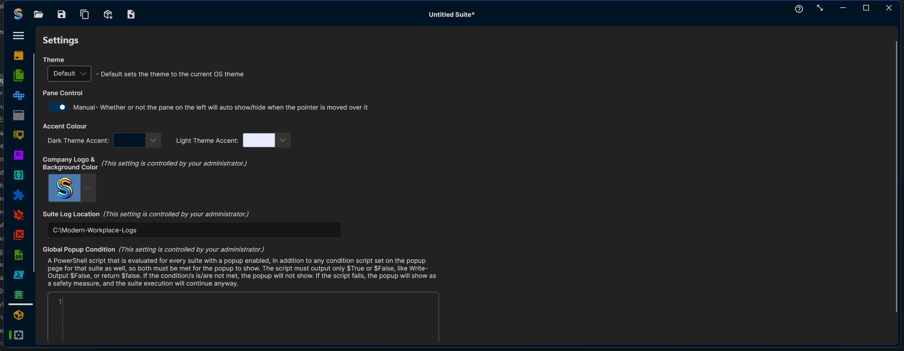
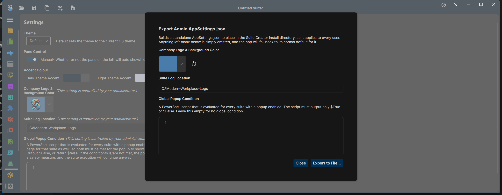
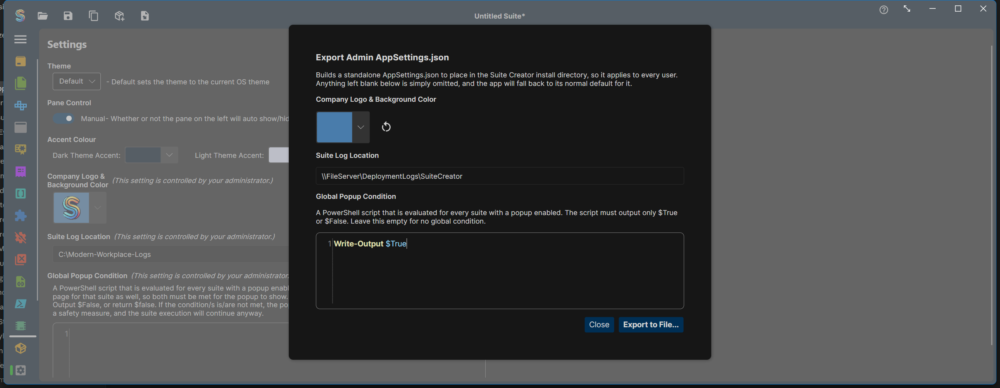
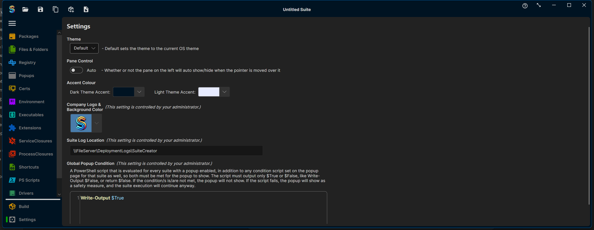

# Admin Guide: Locking Down App-Wide Settings

Suite Creator lets an administrator centrally control a handful of app-wide settings so every packager on the team gets the same values, and can't override them locally. This is done with an `AppSettings.json` file placed in the app's **install directory** (next to `SuiteCreatorAvalonia.Desktop.exe`) — separate from the per-user settings file each packager's own preferences (theme, accent colour, etc.) are saved to.

## What's admin-controlled

| Setting | Purpose |
|---|---|
| **Company Logo & Background Color** | The logo and background colour shown in the end-user popup. |
| **Suite Log Location** | Where the built suite writes its execution logs on the target device. |
| **Global Popup Condition** | A PowerShell script evaluated before *every* popup, across every suite built with this install. It must output only `$True` or `$False`. If it returns `$False`, the popup for that run is skipped; if the script itself fails to run cleanly, the popup shows anyway as a safety measure. |

Once an `AppSettings.json` sets any of these, they become read-only in the Settings page for every user of that install — each field shows *"This setting is controlled by your administrator."* and can no longer be edited or reset locally.



## Building the AppSettings.json

You don't need to hand-write the JSON. There's a built-in export dialog for it:

1. Open the **Settings** page.
2. Press **Ctrl+Shift+A**. (This is intentionally not a visible button — it's an admin-only entry point, not something regular packagers need.)
3. Fill in whichever of the three fields you want to lock down. Anything left blank is simply omitted from the export, and the app falls back to its normal default for it.
4. Click **Export to File...** and save the file as `AppSettings.json`.





## Deploying it

Copy the exported `AppSettings.json` into the same directory as `SuiteCreatorAvalonia.Desktop.exe` on every machine the app is installed on (e.g. bundle it into your install package, or drop it in as a post-install step). It's read once at app startup.

The exported file looks like this — only the fields you filled in are non-null:

```json
{
  "Theme": null,
  "IsManualPaneControl": false,
  "LightAccentColour": null,
  "DarkAccentColour": null,
  "CompanyLogoType": null,
  "CompanyLogoBytes": null,
  "CompanyLogoBackgroundColor": "#ff497cab",
  "LogLocation": "\\\\FileServer\\DeploymentLogs\\SuiteCreator",
  "GlobalPopupCondition": "V3JpdGUtT3V0cHV0ICRUcnVl"
}
```

`GlobalPopupCondition` is the PowerShell script, Base64-encoded (the example above decodes to `Write-Output $True`). `CompanyLogoBytes`/`CompanyLogoType` hold the imported logo image if one was set.

Once the file is in place, every user's Settings page reflects the locked-down values and can no longer change them:



## Notes

- Any other setting (theme, accent colours, pane behaviour) is **not** admin-controlled and remains a per-user preference stored in `%LocalAppData%\SuiteCreator\AppSettings.json`.
- Re-running the export dialog and deploying a new file simply overwrites the previous admin configuration — there's no merge step to worry about.
