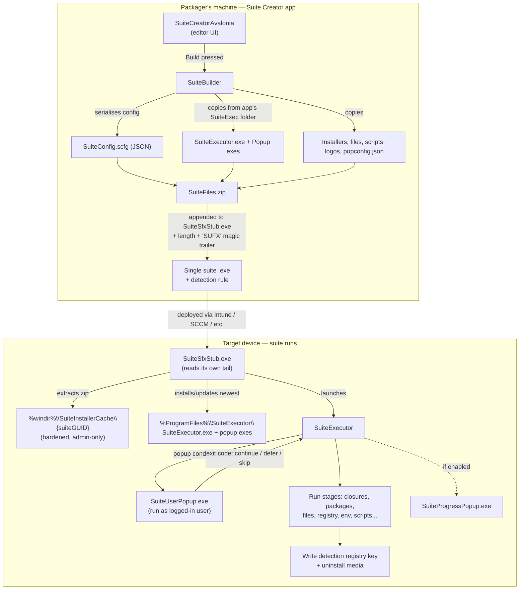

# Developer Guide: Working on this Solution

This document explains how the solution fits together — which projects do what, how they're wired into each other at build time, and what actually happens end-to-end when a packager builds a suite and it runs on a target device. Read this before making changes that cross project boundaries.

## The big picture

There are really **two applications** in this repo, plus the glue between them:

1. **The Creator** (`SuiteCreatorAvalonia` + `SuiteCreatorAvalonia.Desktop`) — the Avalonia desktop app packagers use to design a suite. It runs on the packager's machine.
2. **The runtime** — everything that ends up inside a built suite and runs on the *target* device: `SuiteSfxStub`, `SuiteExecutor`, `SuiteUserPopup`, and `SuiteProgressPopup`.

The Creator doesn't reference the runtime projects as normal project references. Instead it bundles their **published executables** as content, and stitches them into a single self-extracting suite exe at build time.

## Project map

| Project | Role | Notes |
|---|---|---|
| `SuiteCreatorAvalonia` | The editor UI (views, viewmodels, `SuiteBuilder`, settings) | Avalonia 12, MVVM via CommunityToolkit |
| `SuiteCreatorAvalonia.Desktop` | Thin desktop entry point for the Creator | Also owns the MSBuild targets that bundle the runtime exes (see below) |
| `SuiteExecutor` | Runs the suite on the target device: stages, packages, events, popups, detection, fail-safe, deferral | **AOT-published.** Partial `Suite` class split across `Suite.*.cs` files by concern |
| `SuiteUserPopup` | The end-user warning/deferral popup shown before the suite runs | **AOT-published** Avalonia app. Communicates its result back via exit codes |
| `SuiteProgressPopup` | The install-progress window end users see | **AOT-published** Avalonia app |
| `SuiteSfxStub` | Self-extracting bootstrapper the payload zip is appended to | **AOT-published.** Becomes the actual built suite exe |
| `SuiteCreatorModels` | Shared models & enums, including `SuiteExecConfig` (the `.scfg` schema) | Referenced by both Creator and Executor — schema changes affect both sides |
| `SuiteOperations` | The `*ExecEvent` implementations (file, registry, env, cert, driver, PowerShell...) | Shared execution logic used by the Executor |
| `Logger` | Common logging | Referenced everywhere, including the popups |
| `MSITools` / `MSIxTools` | MSI / MSIX inspection and handling | |
| `SystemTools` | Native helpers: robocopy wrapper, PowerShell invocation, environment refresh, native methods | |
| `UserTools` | Impersonation — launching processes as the logged-in user from an elevated/SYSTEM context | This is how the Executor shows popups in the user's session |
| `SuiteUITools` | UI helpers (image loading, shell/browser helpers) shared by the Avalonia apps | |

## How the runtime exes get into the Creator

This is the most important non-obvious wiring in the repo.

`SuiteExecutor`, `SuiteUserPopup`, `SuiteProgressPopup`, and `SuiteSfxStub` each have a `Properties/PublishProfiles/FolderProfile.pubxml` that publishes them **self-contained, win-x64, Native AOT** to `{project}\bin\publish\win-x64\net10.0-windows10.0.22000.0\`. AOT is used deliberately to keep the files small, because these exes get compiled into every built suite.

`SuiteCreatorAvalonia.Desktop.csproj` contains custom MSBuild targets (`CopyOtherPublishFilesOutput`, and a publish-time equivalent) that run after every build:

1. For each of the four runtime projects, check whether its publish folder exists and has files.
2. If not, run `dotnet publish ... /p:PublishProfile=FolderProfile` for it automatically.
3. Copy the published files (minus `.pdb` etc.) into a **`SuiteExec` subfolder** of the Creator's own output directory.

At runtime, `SuiteBuilder` reads everything it bundles from `{AppContext.BaseDirectory}\SuiteExec`.

> **Gotcha:** the auto-publish only triggers when a publish folder is *missing*. If you change code in `SuiteExecutor` or the popups, the Creator will keep bundling the **stale** published copies until you either re-publish that project yourself (`dotnet publish -c Release /p:PublishProfile=FolderProfile`) or delete its `bin\publish` folder and rebuild the Desktop project. If a runtime fix "doesn't seem to do anything", check this first.

> **AOT gotcha:** because these projects are trimmed + AOT, reflection-heavy code needs care. The Avalonia popups keep a `TrimmerRootDescriptor.xml` to protect types the trimmer would otherwise strip. Test runtime changes against the *published* AOT output, not just an F5 debug build — trimming failures only show up in the published exe.

## What happens when a packager presses Build

All of this lives in `SuiteCreatorAvalonia/Services/SuiteBuilder.cs`:

1. The in-memory project is converted to a `SuiteExecConfig` (from `SuiteCreatorModels`) and serialised as JSON to `SuiteConfig.scfg` in a temp folder.
2. The Creator's `SuiteExec` folder (the Executor and its files, excluding the stub and popup exes) is robocopied into the temp folder.
3. Package installers, file-event payloads, scripts, certificates, drivers, etc. are copied in.
4. If a popup is enabled, a `Popup\` subfolder is created containing `SuiteUserPopup.exe`, `SuiteProgressPopup.exe`, `popconfig.json`, the suite logo, and the company logo.
5. The temp folder is zipped, and the zip is appended to a copy of `SuiteSfxStub.exe` with a trailer of `[zip bytes][int32 zip length][int32 magic 'SUFX']`.
6. The result is a single exe, plus a detection rule string (a registry key under the suite's UpgradeCode with a `DisplayVersion` comparison) the packager pastes into their deployment tool.

## What happens on the target device

1. **`SuiteSfxStub.exe`** runs (elevated, from the deployment tool). It reads its own tail to find the zip and extracts it to `%windir%\SuiteInstallerCache\{suiteGUID}` — a deliberately admin-only, hardened location, since everything the elevated Executor later runs comes from here. The `Popup` folder gets Users read/execute so the popup can run in the user's session. If the cache already holds a strictly newer version of the same suite, extraction is skipped.
2. The stub then **installs or updates** `SuiteExecutor.exe`, `SuiteUserPopup.exe`, and `SuiteProgressPopup.exe` into `%ProgramFiles%\SuiteExecutor`, keeping the newest version, and launches the installed Executor pointing at the extracted `SuiteConfig.scfg`.
3. **`SuiteExecutor`** takes over: acquires a mutex, works out the action (Deployment / Removal / Rollback), optionally registers a fail-safe scheduled task so an interrupted run restarts on next boot/logon, and evaluates the popup conditions (global admin condition first, then the per-suite condition — both PowerShell scripts that must output `$True`/`$False`).
4. If a popup should show, the Executor launches `SuiteUserPopup.exe` **as the logged-in user** (via `UserTools` impersonation, since the Executor itself runs elevated/SYSTEM). The popup reports back through exit codes: continue, device locked, error, defer (with a reminder time on stdout), or timer expired. A deferral schedules a reminder task and exits with 1602; the reminder task later re-runs the executor with `--reminder` so it proceeds instead of re-deferring.
5. The suite then executes: service/process closures, then stages of packages and events (implemented in `SuiteOperations`), with `SuiteProgressPopup.exe` showing progress if enabled. Finally it writes the detection registry key, drops uninstall media, refreshes the environment if configured, and cleans up.

Useful Executor flags when debugging: `--debug` (debug builds only — waits in a loop until a debugger attaches, so you can F5-attach to a run started by the stub), `--reminder`, `--failsafe`, plus internal modes `--failsafe-unblock-all` and `--watch-pid`. `SuiteExecutor/DebugAssets` holds a sample `SuiteConfig.scfg` for running the Executor directly from the IDE.

## Conventions & tips

- **Code style:** explicit type declarations over `var`; short type names with `using` directives rather than fully-qualified names; debug-only logic wrapped in `#if DEBUG`.
- **Schema changes:** anything in `SuiteCreatorModels` (especially `SuiteExecConfig`) is shared between the Creator (writer) and Executor (reader). Consider what an *older* installed Executor does with a config written by a *newer* Creator, and vice versa — the stub keeps the newest Executor version machine-wide across all suites.
- **Fail-safe philosophy:** the Executor consistently fails *open* — if a popup script errors, the popup is shown; if a popup can't be evaluated, the suite proceeds. When adding new checks, follow the same "don't strand the user, don't silently kill their apps" reasoning.
- **Creator settings:** per-user settings live in `%LocalAppData%\SuiteCreator\AppSettings.json`; admin-enforced settings come from an `AppSettings.json` next to the Creator exe and win over user settings (see the [admin guide](admin-guide.md)).
- **In-app help:** pages declare `services:Help.Title` / `services:Help.PageSummary` attached properties in XAML — keep these updated when changing a page, as they drive the built-in help overlay.
