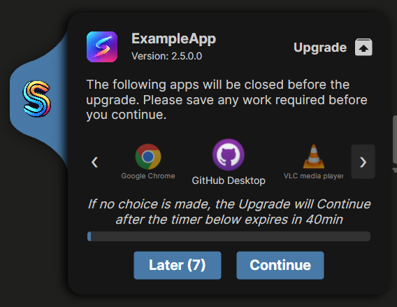
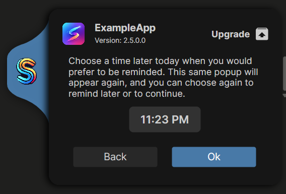

# The User Popup: Warning Users Before a Suite Runs

Deployments have a human problem: the moment your suite closes an app to upgrade it, someone might be halfway through unsaved work in that app. The **user popup** is Suite Creator's answer — a small, branded window shown to the logged-in user *before* the suite makes any changes, telling them what's about to happen, which of their running apps will be closed, and (optionally) letting them defer the run to a time that suits them.

The popup shows:

- Your **company logo** on the coloured tab (set on the Popups page, or [enforced by an admin](admin-guide.md)), and the **suite logo**, product name and version from the Build page.
- The **action** ("Upgrade", "Install", whatever text you choose) with a pickable icon.
- Your **message text** — separate messages for Deployment and for Removal/Rollback runs.
- A row of the user's **running apps that will be closed** (when linked to Process Closures — see below), with their real icons and names.
- A **countdown timer** with what happens when it expires.
- **Later (n)** — defer the run, with the number of remaining delay days shown — and **Continue**.

## Enabling it

On the **Popups** page, tick **Enable warning Popup**. From there you can write the Deployment and Removal/Rollback messages, set the action text and icon, and use **Popup Preview** to see a live sample of exactly what users will get — including switching between the Deployment and Removal previews.

## Linking to Process Closures

The most useful configuration for upgrades: tick **Link to Process Closures** on the Popups page. This changes the popup's behaviour in two ways:

1. **The popup only appears when it matters.** If none of the processes listed on your Process Closures page are actually running on the device, there is nothing to warn the user about — the popup is skipped entirely and the suite proceeds silently.
2. **The popup shows the user exactly which of their apps will be closed**, with each app's real icon and display name (resolved even for Store/MSIX apps), so "save your work" is concrete rather than vague.

Combined with a deferral window, this gives users a genuine chance to finish what they're doing: they see *"these apps of yours will be closed"*, and can either save up and hit **Continue**, or push the whole install to later.

## Deferral: letting users skip the install until later

If **Max Delay Days** is greater than zero, the popup shows a **Later** button with the remaining allowance (e.g. "Later (7)"). Choosing it opens a time picker:

The user picks a time later that day, and the suite exits without making changes (exit code 1602, so your deployment tool records the run accurately). A scheduled reminder task re-runs the suite at the chosen time, where the same popup appears again and they can defer again — until the allowance runs out:

- The **first time** the popup ever shows, the date is recorded. The delay allowance counts down in calendar days from then, not per-click.
- Once the user has burned through the maximum delay days, they're warned; after that the skip option is gone and they get one final countdown of your configured **Timer** length before the suite proceeds.
- Restarting the machine to dodge the final run doesn't work — the deployment runs silently on the next startup/logon instead.

## Timers and unattended edge cases

A popup is only useful if someone is there to see it. These settings (all on the Popups page) control what happens when they aren't:

| Setting | What it controls |
|---|---|
| **Timer** | Minutes the user has to make a choice. A progress bar counts it down on the popup. |
| **Timer Expire Action** | Continue or Skip when the timer runs out with no choice made. |
| **User Logged off action** | What to do when the suite runs with no one logged in. |
| **Locked Device action** | What to do when a user is logged in but the screen is locked/asleep — including if it locks *during* the timer. |
| **ESP action** | What to do during Windows device initial setup (Autopilot ESP). |

## Conditions: showing the popup only when a script says so

Two optional PowerShell gates run before the popup is shown, and both must pass:

1. The **global popup condition** — set by an administrator for every suite built with that install of Suite Creator (see the [admin guide](admin-guide.md)).
2. The **per-suite popup condition** — tick **Set Popup Condition** on the Popups page and write a script.

Each script must output only `$True` (show the popup) or `$False` (skip the popup and continue the suite). If a script errors, the popup is shown anyway — failing safe, so a broken script can never cause users' apps to be closed without warning.

## How it works under the hood

`SuiteUserPopup.exe` is its own small AOT-compiled Avalonia app, bundled into every built suite (see the [developer guide](developer-guide.md)). The elevated `SuiteExecutor` launches it **in the logged-in user's session** and reads the outcome back from its exit code: continue (0), device locked (1), error (2), defer (3, with the chosen reminder time on stdout), timer expired (4), or missing logo (5). Everything the popup displays comes from a `popconfig.json` the Creator writes at build time, plus the logo images bundled next to it.
